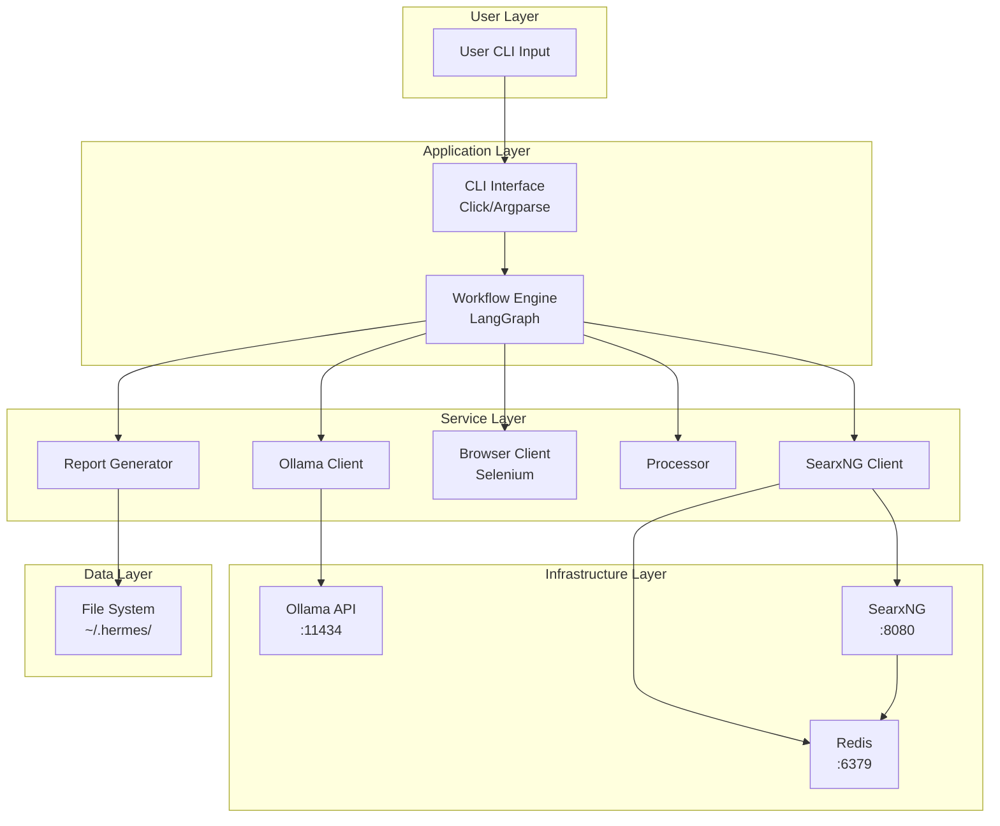
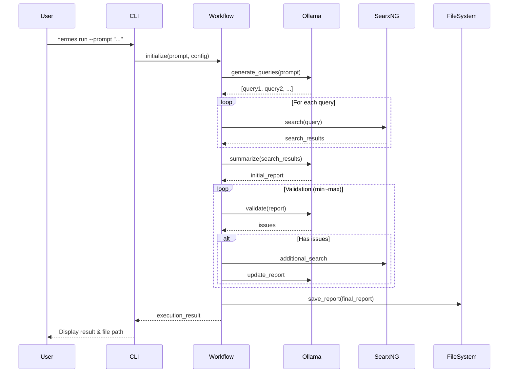

# Hermes システム設計書（実装レベル）

## 目次

1. [はじめに](#1-はじめに)
2. [システム概要](#2-システム概要)
3. [技術スタック](#3-技術スタック)
4. [プロジェクト構造](#4-プロジェクト構造)
5. [データモデル設計](#5-データモデル設計)
6. [モジュール詳細設計](#6-モジュール詳細設計)
7. [ワークフロー実装](#7-ワークフロー実装)
8. [CLI実装](#8-cli実装)
9. [設定管理](#9-設定管理)
10. [ログとエラーハンドリング](#10-ログとエラーハンドリング)
11. [Docker/インフラ構成](#11-dockerインフラ構成)
12. [セキュリティ実装](#12-セキュリティ実装)
13. [テスト実装](#13-テスト実装)
14. [デプロイメント](#14-デプロイメント)
15. [パフォーマンス最適化](#15-パフォーマンス最適化)
16. [将来の拡張](#16-将来の拡張)

---

## 1. はじめに

### 1.1 目的

Hermes は、研究者や技術者向けのローカル実行可能な CLI 情報収集エージェントである。本設計書は、basic_design_version2.md および design_document_detail_version2 を統合し、実装に必要な詳細仕様を提供する。

### 1.2 設計思想

- **完全ローカル実行**: 外部API課金なし、プライバシー保護
- **検証ループによる品質担保**: 情報の矛盾や不足を自動検出・修正
- **拡張性**: プラグイン、マルチエージェント対応を見据えた設計
- **CLI特化**: GUI不要、シェルスクリプトとの統合が容易

### 1.3 参考プロジェクト

- [agenticSeek](https://github.com/Fosowl/agenticSeek): SearxNG + Redis によるメタ検索設計
- [LangGraph](https://github.com/langchain-ai/langgraph): ワークフローDAG管理

---

## 2. システム概要

### 2.1 主要機能

| 機能カテゴリ | 機能 | 説明 |
|------------|------|------|
| **タスク管理** | 登録・一覧・削除 | 調査タスクをYAMLで管理 |
| **実行** | 即時実行・スケジュール実行 | プロンプトまたはタスクIDで実行 |
| **検索** | メタ検索 | SearxNG経由で複数エンジン検索 |
| **要約** | LLM要約 | Ollama (gpt-oss:20b) で情報集約 |
| **検証** | 検証ループ | 矛盾検出と追加検索 |
| **レポート** | Markdown出力 | 引用付きレポート生成 |
| **履歴管理** | 閲覧・エクスポート・削除 | 過去実行結果の管理 |

### 2.2 システムアーキテクチャ



### 2.3 処理フロー概要



---

## 3. 技術スタック

### 3.1 コア技術

| カテゴリ | 技術 | バージョン | 用途 |
|---------|------|----------|------|
| **言語** | Python | 3.10+ | メイン実装言語 |
| **パッケージ管理** | uv | latest | 依存関係管理 |
| **LLM** | Ollama | latest | ローカルLLM推論 |
| **モデル** | gpt-oss:20b | - | デフォルトLLMモデル |
| **検索** | SearxNG | latest | メタ検索エンジン |
| **キャッシュ** | Redis/Valkey | 8-alpine | 検索キャッシュ |
| **ワークフロー** | LangGraph | ^0.2.0 | DAG管理 |

### 3.2 主要ライブラリ

```toml
# pyproject.toml 主要依存関係
[project]
name = "hermes-cli"
version = "0.1.0"
requires-python = ">=3.10"
dependencies = [
    "click>=8.1.7",           # CLI フレームワーク
    "pydantic>=2.5.0",        # データバリデーション
    "pyyaml>=6.0.1",          # YAML パース
    "httpx>=0.27.0",          # 非同期HTTPクライアント
    "langgraph>=0.2.0",       # ワークフローエンジン
    "langchain-core>=0.3.0",  # LangChain基盤
    "selenium>=4.16.0",       # ブラウザ自動化
    "beautifulsoup4>=4.12.0", # HTML パース
    "redis>=5.0.0",           # Redisクライアント
    "loguru>=0.7.2",          # 構造化ログ
    "rich>=13.7.0",           # ターミナル装飾
    "undetected-chromedriver>=3.5.4",  # ステルスブラウザ
]

[project.optional-dependencies]
dev = [
    "pytest>=7.4.0",
    "pytest-asyncio>=0.23.0",
    "pytest-cov>=4.1.0",
    "black>=23.12.0",
    "ruff>=0.1.9",
    "mypy>=1.8.0",
]

[project.scripts]
hermes = "hermes_cli.main:cli"
```

### 3.3 開発ツール

| ツール | 用途 |
|-------|------|
| **black** | コードフォーマッタ |
| **ruff** | 高速リンター |
| **mypy** | 型チェック |
| **pytest** | テストフレームワーク |
| **docker-compose** | インフラ管理 |

---

## 4. プロジェクト構造

### 4.1 ディレクトリ構造

```
Hermes/
├── hermes_cli/                    # メインパッケージ
│   ├── __init__.py
│   ├── main.py                    # CLIエントリーポイント
│   │
│   ├── commands/                  # CLIコマンド実装
│   │   ├── __init__.py
│   │   ├── init_cmd.py            # hermes init
│   │   ├── task_cmd.py            # hermes task
│   │   ├── run_cmd.py             # hermes run
│   │   ├── log_cmd.py             # hermes log
│   │   ├── history_cmd.py         # hermes history
│   │   └── debug_cmd.py           # hermes debug
│   │
│   ├── agents/                    # LangGraph ワークフロー
│   │   ├── __init__.py
│   │   ├── graph.py               # グラフ定義
│   │   ├── state.py               # 状態管理
│   │   └── nodes/                 # ノード実装
│   │       ├── __init__.py
│   │       ├── prompt_normalizer.py
│   │       ├── query_generator.py
│   │       ├── web_researcher.py
│   │       ├── container_processor.py
│   │       ├── draft_aggregator.py
│   │       ├── validator.py
│   │       ├── validation_controller.py
│   │       └── final_reporter.py
│   │
│   ├── services/                  # ビジネスロジック
│   │   ├── __init__.py
│   │   ├── config_service.py
│   │   ├── task_service.py
│   │   ├── run_service.py
│   │   ├── history_service.py
│   │   ├── log_service.py
│   │   ├── queue_service.py
│   │   └── debug_service.py
│   │
│   ├── tools/                     # 外部ツールクライアント
│   │   ├── __init__.py
│   │   ├── ollama_client.py       # Ollama API
│   │   ├── browser_use_client.py  # Selenium ラッパー
│   │   └── container_use_client.py # SearxNG + Redis
│   │
│   ├── persistence/               # データ永続化
│   │   ├── __init__.py
│   │   ├── file_paths.py          # パス定義
│   │   ├── config_repository.py
│   │   ├── task_repository.py
│   │   ├── history_repository.py
│   │   └── log_repository.py
│   │
│   └── models/                    # データモデル (新規)
│       ├── __init__.py
│       ├── config.py              # 設定モデル
│       ├── task.py                # タスクモデル
│       ├── search.py              # 検索結果モデル
│       ├── report.py              # レポートモデル
│       └── state.py               # ワークフロー状態
│
├── tests/                         # テストコード
│   ├── unit/
│   │   ├── test_ollama_client.py
│   │   ├── test_searxng_client.py
│   │   └── test_processor.py
│   ├── integration/
│   │   ├── test_workflow.py
│   │   └── test_validation_loop.py
│   └── e2e/
│       └── test_cli.py
│
├── docs/                          # ドキュメント
│   ├── basic_design_version2.md
│   ├── design_document_detail_version2
│   └── sistem_design.md           # 本ドキュメント
│
├── scripts/                       # ユーティリティスクリプト
│   ├── install.sh
│   └── setup_docker.sh
│
├── .hermes_template/              # テンプレート
│   ├── config.yaml.template
│   └── docker-compose.yaml.template
│
├── pyproject.toml                 # プロジェクト設定
├── uv.lock                        # ロックファイル
├── README.md
└── LICENSE
```

### 4.2 ユーザーディレクトリ構造

```
~/.hermes/                         # ユーザーワークスペース
├── config.yaml                    # ユーザー設定
├── docker-compose.yaml            # Docker設定
│
├── cache/                         # 一時キャッシュ
│   └── .gitkeep
│
├── task/                          # タスク定義
│   ├── 2025-0001.yaml
│   └── 2025-0002.yaml
│
├── log/                           # 通常ログ
│   ├── hermes.2025-01-15.log
│   └── hermes.2025-01-16.log
│
├── debug_log/                     # デバッグログ
│   └── debug.2025-01-15.log
│
├── history/                       # 実行履歴
│   ├── report-2025-0001.md
│   ├── report-2025-0001.meta.yaml
│   ├── report-2025-0002.md
│   └── report-2025-0002.meta.yaml
│
└── searxng/                       # SearxNG設定
    └── settings.yml
```

---

## 5. データモデル設計

### 5.1 設定モデル (hermes_cli/models/config.py)

```python
from pydantic import BaseModel, Field, HttpUrl, validator
from typing import Optional, Literal
from pathlib import Path

class OllamaConfig(BaseModel):
    """Ollama API設定"""
    api_url: HttpUrl = Field(
        default="http://localhost:11434/api/chat",
        description="Ollama APIエンドポイント"
    )
    model: str = Field(
        default="gpt-oss:20b",
        description="使用するLLMモデル"
    )
    timeout: int = Field(default=120, ge=10, le=600, description="タイムアウト秒")
    retry: int = Field(default=3, ge=0, le=10, description="リトライ回数")
    temperature: float = Field(default=0.7, ge=0.0, le=2.0)
    max_tokens: int = Field(default=4096, ge=128, le=32768)

class SearchConfig(BaseModel):
    """検索設定"""
    searxng_base_url: HttpUrl = Field(
        default="http://localhost:8080",
        description="SearxNGベースURL"
    )
    redis_url: str = Field(
        default="redis://localhost:6379/0",
        description="RedisベースURL"
    )
    min_search: int = Field(default=3, ge=1, le=20, description="最小ソース数")
    max_search: int = Field(default=8, ge=1, le=50, description="最大ソース数")
    query_count: int = Field(default=3, ge=1, le=10, description="クエリ生成数")
    cache_ttl: int = Field(default=3600, description="キャッシュTTL(秒)")

class ValidationConfig(BaseModel):
    """検証設定"""
    min_validation: int = Field(default=1, ge=0, le=10)
    max_validation: int = Field(default=3, ge=0, le=10)

    @validator('max_validation')
    def validate_max(cls, v, values):
        if 'min_validation' in values and v < values['min_validation']:
            raise ValueError('max_validation must be >= min_validation')
        return v

class BrowserConfig(BaseModel):
    """ブラウザ設定"""
    headless: bool = Field(default=True, description="ヘッドレスモード")
    stealth_mode: bool = Field(default=True, description="ステルスモード")
    timeout: int = Field(default=30, ge=5, le=180)
    user_agent: Optional[str] = None

class LoggingConfig(BaseModel):
    """ロギング設定"""
    level: Literal["DEBUG", "INFO", "WARNING", "ERROR"] = "INFO"
    format: str = "{time:YYYY-MM-DDTHH:mm:ss.SSSSSSZ} [{level}] [{extra[category]}] {message}"
    rotation: str = "1 day"
    retention: str = "30 days"

class LangfuseConfig(BaseModel):
    """Langfuse設定 (オプション)"""
    enabled: bool = False
    base_url: Optional[HttpUrl] = "https://cloud.langfuse.com"
    public_key: Optional[str] = None
    secret_key: Optional[str] = None

class HermesConfig(BaseModel):
    """Hermes全体設定"""
    work_dir: Path = Field(default=Path.home() / ".hermes")
    language: Literal["ja", "en"] = "ja"

    ollama: OllamaConfig = Field(default_factory=OllamaConfig)
    search: SearchConfig = Field(default_factory=SearchConfig)
    validation: ValidationConfig = Field(default_factory=ValidationConfig)
    browser: BrowserConfig = Field(default_factory=BrowserConfig)
    logging: LoggingConfig = Field(default_factory=LoggingConfig)
    langfuse: LangfuseConfig = Field(default_factory=LangfuseConfig)

    class Config:
        use_enum_values = True

    def save_to_yaml(self, path: Path) -> None:
        """YAMLファイルに保存"""
        import yaml
        with open(path, 'w', encoding='utf-8') as f:
            yaml.dump(
                self.model_dump(mode='json', exclude_none=True),
                f,
                allow_unicode=True,
                default_flow_style=False
            )

    @classmethod
    def load_from_yaml(cls, path: Path) -> 'HermesConfig':
        """YAMLファイルから読み込み"""
        import yaml
        with open(path, 'r', encoding='utf-8') as f:
            data = yaml.safe_load(f)
        return cls(**data)
```

### 5.2 タスクモデル (hermes_cli/models/task.py)

```python
from pydantic import BaseModel, Field
from typing import Optional, Literal
from datetime import datetime
from pathlib import Path

class TaskOptions(BaseModel):
    """タスク固有オプション"""
    language: Optional[str] = None
    query_count: Optional[int] = None
    min_validation: Optional[int] = None
    max_validation: Optional[int] = None

class Task(BaseModel):
    """タスク定義"""
    id: str = Field(..., pattern=r'^\d{4}-\d{4}$', description="タスクID (YYYY-NNNN)")
    prompt: str = Field(..., min_length=1, description="調査プロンプト")
    status: Literal["scheduled", "running", "completed", "failed"] = "scheduled"
    created_at: datetime = Field(default_factory=datetime.now)
    updated_at: Optional[datetime] = None
    options: Optional[TaskOptions] = None

    def to_yaml(self) -> str:
        """YAML形式で出力"""
        import yaml
        return yaml.dump(
            self.model_dump(mode='json'),
            allow_unicode=True,
            default_flow_style=False
        )

    @classmethod
    def from_yaml(cls, yaml_str: str) -> 'Task':
        """YAML形式から読み込み"""
        import yaml
        data = yaml.safe_load(yaml_str)
        return cls(**data)

    def save(self, task_dir: Path) -> None:
        """ファイルに保存"""
        file_path = task_dir / f"{self.id}.yaml"
        with open(file_path, 'w', encoding='utf-8') as f:
            f.write(self.to_yaml())
```

### 5.3 検索結果モデル (hermes_cli/models/search.py)

```python
from pydantic import BaseModel, HttpUrl
from typing import List, Optional
from datetime import datetime

class SearchResult(BaseModel):
    """単一検索結果"""
    title: str
    url: HttpUrl
    snippet: str
    engine: Optional[str] = None
    score: Optional[float] = None

class SearchResponse(BaseModel):
    """検索レスポンス"""
    query: str
    results: List[SearchResult]
    total_results: int
    search_time: float
    cached: bool = False
    timestamp: datetime = Field(default_factory=datetime.now)

class ScrapedContent(BaseModel):
    """スクレイプコンテンツ"""
    url: HttpUrl
    title: str
    content: str
    extracted_at: datetime = Field(default_factory=datetime.now)
    word_count: int = 0

    @validator('word_count', always=True)
    def set_word_count(cls, v, values):
        if 'content' in values:
            return len(values['content'].split())
        return v
```

### 5.4 レポートモデル (hermes_cli/models/report.py)

```python
from pydantic import BaseModel, Field, HttpUrl
from typing import List, Optional
from datetime import datetime

class Citation(BaseModel):
    """引用情報"""
    index: int
    url: HttpUrl
    title: str
    accessed_at: datetime

class ReportSection(BaseModel):
    """レポートセクション"""
    title: str
    content: str
    citations: List[int] = Field(default_factory=list)

class Report(BaseModel):
    """レポート"""
    title: str
    sections: List[ReportSection]
    citations: List[Citation]

    def to_markdown(self) -> str:
        """Markdown形式で出力"""
        md = f"# {self.title}\n\n"

        for section in self.sections:
            md += f"## {section.title}\n\n"
            md += f"{section.content}\n\n"

        if self.citations:
            md += "## 参考文献\n\n"
            for cite in self.citations:
                md += f"[{cite.index}] {cite.title}  \n{cite.url}\n\n"

        return md

class ReportMetadata(BaseModel):
    """レポートメタデータ"""
    task_id: str
    status: Literal["success", "failed"]
    start_at: datetime
    finish_at: datetime
    duration: float  # 秒
    model: str
    loops: int  # 実行した検証ループ数
    sources: int  # 収集ソース数
    error: Optional[str] = None

    def to_yaml(self) -> str:
        """YAML形式で出力"""
        import yaml
        return yaml.dump(
            self.model_dump(mode='json'),
            allow_unicode=True,
            default_flow_style=False
        )
```

### 5.5 ワークフロー状態モデル (hermes_cli/models/state.py)

```python
from pydantic import BaseModel, Field
from typing import List, Optional, Dict, Any
from datetime import datetime

class WorkflowState(BaseModel):
    """LangGraphワークフロー状態"""
    # 入力
    original_prompt: str
    normalized_prompt: Optional[str] = None
    config: Dict[str, Any] = Field(default_factory=dict)

    # クエリ生成
    queries: List[str] = Field(default_factory=list)

    # 検索結果
    search_responses: List['SearchResponse'] = Field(default_factory=list)
    scraped_contents: List['ScrapedContent'] = Field(default_factory=list)

    # 処理結果
    summarized_data: Optional[str] = None

    # レポート
    draft_report: Optional['Report'] = None
    final_report: Optional['Report'] = None

    # 検証
    validation_loop: int = 0
    validation_issues: List[str] = Field(default_factory=list)

    # メタ情報
    start_time: datetime = Field(default_factory=datetime.now)
    current_node: Optional[str] = None
    errors: List[Dict[str, Any]] = Field(default_factory=list)

    class Config:
        arbitrary_types_allowed = True
```

---

## 6. モジュール詳細設計

### 6.1 Ollama Client (hermes_cli/tools/ollama_client.py)

```python
import httpx
from typing import Optional, Dict, Any
from loguru import logger
import asyncio

class OllamaClient:
    """Ollama API クライアント"""

    def __init__(
        self,
        api_url: str,
        model: str,
        timeout: int = 120,
        retry: int = 3,
        temperature: float = 0.7,
        max_tokens: int = 4096
    ):
        self.api_url = api_url
        self.model = model
        self.timeout = timeout
        self.retry = retry
        self.temperature = temperature
        self.max_tokens = max_tokens
        self.client = httpx.AsyncClient(timeout=timeout)

    async def chat(
        self,
        prompt: str,
        system_prompt: Optional[str] = None,
        **kwargs
    ) -> str:
        """チャット実行"""
        for attempt in range(self.retry):
            try:
                messages = []
                if system_prompt:
                    messages.append({"role": "system", "content": system_prompt})
                messages.append({"role": "user", "content": prompt})

                payload = {
                    "model": self.model,
                    "messages": messages,
                    "stream": False,
                    "options": {
                        "temperature": kwargs.get("temperature", self.temperature),
                        "num_predict": kwargs.get("max_tokens", self.max_tokens),
                    }
                }

                logger.debug(f"Ollama request attempt {attempt + 1}/{self.retry}")

                response = await self.client.post(
                    self.api_url,
                    json=payload
                )
                response.raise_for_status()

                result = response.json()
                content = result["message"]["content"]

                logger.info(
                    f"Ollama response received",
                    extra={
                        "category": "OLLAMA",
                        "model": self.model,
                        "prompt_length": len(prompt),
                        "response_length": len(content)
                    }
                )

                return content

            except Exception as e:
                logger.warning(
                    f"Ollama request failed: {e}",
                    extra={"category": "OLLAMA", "attempt": attempt + 1}
                )
                if attempt == self.retry - 1:
                    raise
                await asyncio.sleep(2 ** attempt)  # Exponential backoff

        raise RuntimeError("Ollama request failed after all retries")

    async def generate_queries(
        self,
        prompt: str,
        num_queries: int = 3
    ) -> List[str]:
        """検索クエリ生成"""
        system_prompt = """あなたは調査エージェントです。
ユーザーのプロンプトを分析し、効果的な検索クエリを生成してください。
各クエリは1行で、異なる観点から情報を集められるようにしてください。"""

        user_prompt = f"""以下のプロンプトに対して、{num_queries}個の検索クエリを生成してください：

{prompt}

各クエリを1行ずつ出力してください。"""

        response = await self.chat(user_prompt, system_prompt)
        queries = [q.strip() for q in response.strip().split('\n') if q.strip()]

        return queries[:num_queries]

    async def summarize(
        self,
        contents: List[str],
        prompt: str
    ) -> str:
        """コンテンツ要約"""
        system_prompt = """あなたは情報整理の専門家です。
複数のソースから得られた情報を統合し、簡潔に要約してください。
矛盾する情報がある場合は両論を併記してください。"""

        combined = "\n\n---\n\n".join(contents)
        user_prompt = f"""元の質問: {prompt}

以下の情報を要約してください：

{combined}"""

        return await self.chat(user_prompt, system_prompt)

    async def validate(
        self,
        report: str,
        original_prompt: str
    ) -> Dict[str, Any]:
        """レポート検証"""
        system_prompt = """あなたは品質管理の専門家です。
レポートを分析し、以下の観点で評価してください：
1. 矛盾や論理的誤りはないか
2. 元の質問に十分に答えているか
3. 追加調査が必要な点はないか

評価結果をJSON形式で返してください：
{
  "has_issues": true/false,
  "issues": ["問題点1", "問題点2", ...],
  "additional_queries": ["追加クエリ1", ...]
}"""

        user_prompt = f"""元の質問: {original_prompt}

レポート:
{report}

上記レポートを評価してください。"""

        response = await self.chat(user_prompt, system_prompt)

        # JSON抽出（LLMが余分なテキストを含む可能性を考慮）
        import json
        import re
        json_match = re.search(r'\{.*\}', response, re.DOTALL)
        if json_match:
            return json.loads(json_match.group())
        else:
            return {"has_issues": False, "issues": [], "additional_queries": []}

    async def close(self):
        """クライアントクローズ"""
        await self.client.aclose()
```

### 6.2 SearxNG Client (hermes_cli/tools/container_use_client.py)

```python
import httpx
import redis.asyncio as redis
from typing import List, Optional
from loguru import logger
import hashlib
import json

class SearxNGClient:
    """SearxNG + Redis クライアント"""

    def __init__(
        self,
        searxng_url: str,
        redis_url: str,
        cache_ttl: int = 3600
    ):
        self.searxng_url = searxng_url.rstrip('/')
        self.cache_ttl = cache_ttl
        self.http_client = httpx.AsyncClient(timeout=30)
        self.redis_client = redis.from_url(redis_url, decode_responses=True)

    def _cache_key(self, query: str, category: str = "general") -> str:
        """キャッシュキー生成"""
        key_str = f"searxng:{category}:{query}"
        return hashlib.sha256(key_str.encode()).hexdigest()

    async def search(
        self,
        query: str,
        category: str = "general",
        num_results: int = 10,
        use_cache: bool = True
    ) -> 'SearchResponse':
        """検索実行"""
        from hermes_cli.models.search import SearchResponse, SearchResult

        # キャッシュチェック
        cache_key = self._cache_key(query, category)
        if use_cache:
            cached = await self.redis_client.get(cache_key)
            if cached:
                logger.info(
                    f"Cache hit for query: {query}",
                    extra={"category": "WEB"}
                )
                data = json.loads(cached)
                return SearchResponse(**data)

        # SearxNG検索
        try:
            logger.info(f"Searching: {query}", extra={"category": "WEB"})

            params = {
                "q": query,
                "format": "json",
                "categories": category,
                "pageno": 1
            }

            response = await self.http_client.get(
                f"{self.searxng_url}/search",
                params=params
            )
            response.raise_for_status()

            data = response.json()
            results = []

            for item in data.get("results", [])[:num_results]:
                results.append(SearchResult(
                    title=item.get("title", ""),
                    url=item.get("url", ""),
                    snippet=item.get("content", ""),
                    engine=item.get("engine"),
                    score=item.get("score")
                ))

            search_response = SearchResponse(
                query=query,
                results=results,
                total_results=len(results),
                search_time=data.get("search_time", 0.0),
                cached=False
            )

            # キャッシュ保存
            await self.redis_client.setex(
                cache_key,
                self.cache_ttl,
                search_response.model_dump_json()
            )

            logger.info(
                f"Search completed: {len(results)} results",
                extra={"category": "WEB", "query": query}
            )

            return search_response

        except Exception as e:
            logger.error(
                f"Search failed: {e}",
                extra={"category": "WEB", "query": query}
            )
            raise

    async def health_check(self) -> bool:
        """ヘルスチェック"""
        try:
            # SearxNG
            response = await self.http_client.get(f"{self.searxng_url}/")
            response.raise_for_status()

            # Redis
            await self.redis_client.ping()

            return True
        except Exception as e:
            logger.error(f"Health check failed: {e}", extra={"category": "DOCKER"})
            return False

    async def close(self):
        """クライアントクローズ"""
        await self.http_client.aclose()
        await self.redis_client.close()
```

### 6.3 Browser Client (hermes_cli/tools/browser_use_client.py)

```python
from selenium import webdriver
from selenium.webdriver.chrome.service import Service
from selenium.webdriver.common.by import By
from selenium.webdriver.support.ui import WebDriverWait
from selenium.webdriver.support import expected_conditions as EC
from bs4 import BeautifulSoup
import undetected_chromedriver as uc
from typing import Optional
from loguru import logger

class BrowserClient:
    """ヘッドレスブラウザクライアント"""

    def __init__(
        self,
        headless: bool = True,
        stealth_mode: bool = True,
        timeout: int = 30
    ):
        self.headless = headless
        self.stealth_mode = stealth_mode
        self.timeout = timeout
        self.driver: Optional[webdriver.Chrome] = None

    def _init_driver(self):
        """ドライバー初期化"""
        if self.stealth_mode:
            options = uc.ChromeOptions()
            if self.headless:
                options.add_argument('--headless=new')
            options.add_argument('--no-sandbox')
            options.add_argument('--disable-dev-shm-usage')
            self.driver = uc.Chrome(options=options)
        else:
            options = webdriver.ChromeOptions()
            if self.headless:
                options.add_argument('--headless=new')
            options.add_argument('--no-sandbox')
            options.add_argument('--disable-dev-shm-usage')
            self.driver = webdriver.Chrome(options=options)

        self.driver.set_page_load_timeout(self.timeout)

    async def extract_text(self, url: str) -> str:
        """URLからテキスト抽出"""
        if not self.driver:
            self._init_driver()

        try:
            logger.info(f"Extracting text from: {url}", extra={"category": "WEB"})

            self.driver.get(url)

            # ページ読み込み待機
            WebDriverWait(self.driver, self.timeout).until(
                EC.presence_of_element_located((By.TAG_NAME, "body"))
            )

            # HTMLソース取得
            html = self.driver.page_source

            # BeautifulSoupでパース
            soup = BeautifulSoup(html, 'html.parser')

            # スクリプト・スタイル削除
            for script in soup(["script", "style", "nav", "footer", "header"]):
                script.decompose()

            # テキスト抽出
            text = soup.get_text(separator='\n', strip=True)

            # 空行削除
            lines = [line for line in text.split('\n') if line.strip()]
            clean_text = '\n'.join(lines)

            logger.info(
                f"Text extracted: {len(clean_text)} chars",
                extra={"category": "WEB", "url": url}
            )

            return clean_text

        except Exception as e:
            logger.error(
                f"Text extraction failed: {e}",
                extra={"category": "WEB", "url": url}
            )
            return ""

    def close(self):
        """ブラウザクローズ"""
        if self.driver:
            self.driver.quit()
            self.driver = None
```

### 6.4 Config Service (hermes_cli/services/config_service.py)

```python
from pathlib import Path
from typing import Optional
from loguru import logger
from hermes_cli.models.config import HermesConfig

class ConfigService:
    """設定管理サービス"""

    @staticmethod
    def get_config_path(work_dir: Optional[Path] = None) -> Path:
        """設定ファイルパス取得"""
        if work_dir is None:
            work_dir = Path.home() / ".hermes"
        return work_dir / "config.yaml"

    @staticmethod
    def load(work_dir: Optional[Path] = None) -> HermesConfig:
        """設定読み込み"""
        config_path = ConfigService.get_config_path(work_dir)

        if not config_path.exists():
            logger.warning(
                f"Config not found, using defaults: {config_path}",
                extra={"category": "CONFIG"}
            )
            return HermesConfig()

        try:
            config = HermesConfig.load_from_yaml(config_path)
            logger.info(
                f"Config loaded: {config_path}",
                extra={"category": "CONFIG"}
            )
            return config
        except Exception as e:
            logger.error(
                f"Failed to load config: {e}",
                extra={"category": "CONFIG"}
            )
            raise

    @staticmethod
    def save(config: HermesConfig, work_dir: Optional[Path] = None) -> None:
        """設定保存"""
        config_path = ConfigService.get_config_path(work_dir)
        config_path.parent.mkdir(parents=True, exist_ok=True)

        try:
            config.save_to_yaml(config_path)
            logger.info(
                f"Config saved: {config_path}",
                extra={"category": "CONFIG"}
            )
        except Exception as e:
            logger.error(
                f"Failed to save config: {e}",
                extra={"category": "CONFIG"}
            )
            raise

    @staticmethod
    def merge_with_cli_args(
        config: HermesConfig,
        cli_args: dict
    ) -> HermesConfig:
        """CLIオプションとマージ"""
        # CLIオプションが指定されている場合は上書き
        if cli_args.get('model'):
            config.ollama.model = cli_args['model']
        if cli_args.get('api'):
            config.ollama.api_url = cli_args['api']
        if cli_args.get('language'):
            config.language = cli_args['language']
        # ... 他のオプション

        return config
```

---

## 7. ワークフロー実装

### 7.1 グラフ定義 (hermes_cli/agents/graph.py)

```python
from langgraph.graph import StateGraph, END
from hermes_cli.models.state import WorkflowState
from hermes_cli.agents.nodes import (
    prompt_normalizer,
    query_generator,
    web_researcher,
    container_processor,
    draft_aggregator,
    validator,
    validation_controller,
    final_reporter
)

def create_workflow() -> StateGraph:
    """Hermesワークフロー作成"""

    workflow = StateGraph(WorkflowState)

    # ノード追加
    workflow.add_node("normalize", prompt_normalizer.normalize)
    workflow.add_node("generate_queries", query_generator.generate)
    workflow.add_node("search", web_researcher.search)
    workflow.add_node("process", container_processor.process)
    workflow.add_node("draft", draft_aggregator.create_draft)
    workflow.add_node("validate", validator.validate)
    workflow.add_node("control", validation_controller.should_continue)
    workflow.add_node("finalize", final_reporter.finalize)

    # エッジ定義
    workflow.set_entry_point("normalize")
    workflow.add_edge("normalize", "generate_queries")
    workflow.add_edge("generate_queries", "search")
    workflow.add_edge("search", "process")
    workflow.add_edge("process", "draft")
    workflow.add_edge("draft", "validate")
    workflow.add_edge("validate", "control")

    # 条件分岐
    workflow.add_conditional_edges(
        "control",
        lambda state: validation_controller.decide(state),
        {
            "continue": "search",  # 追加検索
            "finish": "finalize"    # 終了
        }
    )

    workflow.add_edge("finalize", END)

    return workflow.compile()
```

### 7.2 ノード実装例 (hermes_cli/agents/nodes/query_generator.py)

```python
from hermes_cli.models.state import WorkflowState
from hermes_cli.tools.ollama_client import OllamaClient
from loguru import logger

class QueryGenerator:
    """クエリ生成ノード"""

    def __init__(self, ollama_client: OllamaClient):
        self.client = ollama_client

    async def generate(self, state: WorkflowState) -> WorkflowState:
        """クエリ生成実行"""
        logger.info("Generating queries", extra={"category": "RUN"})

        state.current_node = "generate_queries"

        try:
            num_queries = state.config.get("query_count", 3)
            queries = await self.client.generate_queries(
                state.normalized_prompt,
                num_queries=num_queries
            )

            state.queries = queries

            logger.info(
                f"Generated {len(queries)} queries",
                extra={"category": "RUN", "queries": queries}
            )

        except Exception as e:
            logger.error(f"Query generation failed: {e}", extra={"category": "RUN"})
            state.errors.append({
                "node": "generate_queries",
                "error": str(e)
            })
            raise

        return state
```

### 7.3 検証コントローラー (hermes_cli/agents/nodes/validation_controller.py)

```python
from hermes_cli.models.state import WorkflowState
from loguru import logger

class ValidationController:
    """検証ループ制御"""

    @staticmethod
    def should_continue(state: WorkflowState) -> WorkflowState:
        """継続判定"""
        state.validation_loop += 1

        min_val = state.config.get("min_validation", 1)
        max_val = state.config.get("max_validation", 3)

        logger.info(
            f"Validation loop: {state.validation_loop}/{max_val}",
            extra={"category": "RUN"}
        )

        return state

    @staticmethod
    def decide(state: WorkflowState) -> str:
        """次のステップ決定"""
        min_val = state.config.get("min_validation", 1)
        max_val = state.config.get("max_validation", 3)

        # 最大回数到達
        if state.validation_loop >= max_val:
            logger.info("Max validation reached, finalizing", extra={"category": "RUN"})
            return "finish"

        # 最小回数未満は継続
        if state.validation_loop < min_val:
            logger.info("Min validation not reached, continuing", extra={"category": "RUN"})
            return "continue"

        # 問題がなければ終了
        if not state.validation_issues:
            logger.info("No issues found, finalizing", extra={"category": "RUN"})
            return "finish"

        # 問題があれば継続
        logger.info(
            f"Issues found: {len(state.validation_issues)}, continuing",
            extra={"category": "RUN"}
        )
        return "continue"
```

---

## 8. CLI実装

### 8.1 メインエントリーポイント (hermes_cli/main.py)

```python
import click
from pathlib import Path
from loguru import logger
from hermes_cli.commands import (
    init_cmd,
    task_cmd,
    run_cmd,
    log_cmd,
    history_cmd,
    debug_cmd
)

@click.group()
@click.version_option(version="0.1.0")
def cli():
    """Hermes - ローカルLLM情報収集エージェント"""
    pass

# コマンド登録
cli.add_command(init_cmd.init)
cli.add_command(task_cmd.task)
cli.add_command(run_cmd.run)
cli.add_command(log_cmd.log)
cli.add_command(history_cmd.history)
cli.add_command(debug_cmd.debug)

if __name__ == "__main__":
    cli()
```

### 8.2 Init コマンド (hermes_cli/commands/init_cmd.py)

```python
import click
from pathlib import Path
from loguru import logger
from rich.console import Console
from hermes_cli.models.config import HermesConfig
from hermes_cli.services.config_service import ConfigService
import shutil

console = Console()

@click.command()
@click.option(
    '--work-dir',
    type=click.Path(path_type=Path),
    default=Path.home() / ".hermes",
    help="ワークディレクトリパス"
)
@click.option(
    '--clear',
    is_flag=True,
    help="既存設定を削除して再初期化"
)
def init(work_dir: Path, clear: bool):
    """Hermesワークスペース初期化"""

    if work_dir.exists() and not clear:
        console.print(
            f"[yellow]Hermes is already initialized at {work_dir}[/yellow]"
        )
        console.print("Use --clear to reinitialize")
        return

    if clear and work_dir.exists():
        console.print(f"[yellow]Clearing existing workspace...[/yellow]")
        shutil.rmtree(work_dir)

    # ディレクトリ作成
    console.print(f"[blue]Initializing Hermes workspace at {work_dir}[/blue]")

    directories = [
        work_dir,
        work_dir / "cache",
        work_dir / "task",
        work_dir / "log",
        work_dir / "debug_log",
        work_dir / "history",
        work_dir / "searxng"
    ]

    for dir_path in directories:
        dir_path.mkdir(parents=True, exist_ok=True)
        console.print(f"  ✓ Created {dir_path.name}/")

    # デフォルト設定保存
    config = HermesConfig(work_dir=work_dir)
    ConfigService.save(config, work_dir)
    console.print(f"  ✓ Created config.yaml")

    # docker-compose.yaml コピー
    template_dir = Path(__file__).parent.parent.parent / ".hermes_template"
    docker_compose_src = template_dir / "docker-compose.yaml.template"
    docker_compose_dst = work_dir / "docker-compose.yaml"

    if docker_compose_src.exists():
        shutil.copy(docker_compose_src, docker_compose_dst)
        console.print(f"  ✓ Created docker-compose.yaml")

    console.print("\n[green]✓ Hermes initialized successfully![/green]")
    console.print("\nNext steps:")
    console.print(f"  1. cd {work_dir}")
    console.print("  2. docker compose up -d")
    console.print("  3. hermes run --prompt 'Your research question'")
```

### 8.3 Run コマンド (hermes_cli/commands/run_cmd.py)

```python
import click
from pathlib import Path
from rich.console import Console
from rich.progress import Progress, SpinnerColumn, TextColumn
from hermes_cli.services.run_service import RunService
from hermes_cli.services.config_service import ConfigService
import asyncio

console = Console()

@click.command()
# コア
@click.option('--prompt', type=str, help="即時実行プロンプト")
@click.option('--task-id', type=str, help="実行するタスクID")
@click.option('--task-all', is_flag=True, help="全タスク実行")
@click.option('--export', type=click.Path(path_type=Path), help="レポート出力パス")
@click.option('--clear', is_flag=True, help="設定リセット")
# LLM
@click.option('--api', type=str, help="Ollama APIエンドポイント")
@click.option('--model', type=str, help="LLMモデル名")
@click.option('--retry', type=int, help="リトライ回数")
# 検証
@click.option('--min-validation', type=int, help="最小検証ループ数")
@click.option('--max-validation', type=int, help="最大検証ループ数")
# 検索
@click.option('--min-search', type=int, help="最小ソース数")
@click.option('--max-search', type=int, help="最大ソース数")
@click.option('--query', type=int, help="クエリ生成数")
# 出力
@click.option('--language', type=click.Choice(['ja', 'en']), help="出力言語")
# その他
@click.option('--langfuse', is_flag=True, help="Langfuseトレース有効化")
@click.option('--work-dir', type=click.Path(path_type=Path), help="ワークディレクトリ")
def run(**kwargs):
    """リサーチタスク実行"""

    # 設定読み込み
    work_dir = kwargs.get('work_dir') or Path.home() / ".hermes"
    config = ConfigService.load(work_dir)

    # CLIオプションマージ
    cli_args = {k: v for k, v in kwargs.items() if v is not None}
    config = ConfigService.merge_with_cli_args(config, cli_args)

    # サービス初期化
    run_service = RunService(config)

    # 実行
    with Progress(
        SpinnerColumn(),
        TextColumn("[progress.description]{task.description}"),
        console=console
    ) as progress:
        task = progress.add_task("Running Hermes...", total=None)

        try:
            result = asyncio.run(run_service.execute(
                prompt=kwargs.get('prompt'),
                task_id=kwargs.get('task_id'),
                task_all=kwargs.get('task_all', False)
            ))

            progress.update(task, completed=True)

            console.print("\n[green]✓ Execution completed![/green]")
            console.print(f"Report saved to: {result['report_path']}")

            if kwargs.get('export'):
                import shutil
                shutil.copy(result['report_path'], kwargs['export'])
                console.print(f"Exported to: {kwargs['export']}")

        except Exception as e:
            progress.update(task, completed=True)
            console.print(f"\n[red]✗ Execution failed: {e}[/red]")
            raise click.Abort()
```

---

## 9. 設定管理

### 9.1 config.yaml デフォルト値

```yaml
# Hermes 設定ファイル

# 作業ディレクトリ
work_dir: ~/.hermes

# 出力言語 (ja/en)
language: ja

# Ollama 設定
ollama:
  api_url: http://localhost:11434/api/chat
  model: gpt-oss:20b
  timeout: 120
  retry: 3
  temperature: 0.7
  max_tokens: 4096

# 検索設定
search:
  searxng_base_url: http://localhost:8080
  redis_url: redis://localhost:6379/0
  min_search: 3
  max_search: 8
  query_count: 3
  cache_ttl: 3600

# 検証設定
validation:
  min_validation: 1
  max_validation: 3

# ブラウザ設定
browser:
  headless: true
  stealth_mode: true
  timeout: 30
  user_agent: null

# ロギング設定
logging:
  level: INFO
  format: "{time:YYYY-MM-DDTHH:mm:ss.SSSSSSZ} [{level}] [{extra[category]}] {message}"
  rotation: "1 day"
  retention: "30 days"

# Langfuse設定 (オプション)
langfuse:
  enabled: false
  base_url: https://cloud.langfuse.com
  public_key: null
  secret_key: null
```

---

## 10. ログとエラーハンドリング

### 10.1 ロギング初期化

```python
from loguru import logger
from pathlib import Path
import sys

def setup_logging(config: 'HermesConfig'):
    """ロギング設定"""

    # デフォルトハンドラー削除
    logger.remove()

    # コンソール出力
    logger.add(
        sys.stderr,
        format=config.logging.format,
        level=config.logging.level,
        colorize=True
    )

    # 通常ログファイル
    log_file = config.work_dir / "log" / "hermes.{time:YYYY-MM-DD}.log"
    logger.add(
        log_file,
        format=config.logging.format,
        level="INFO",
        rotation=config.logging.rotation,
        retention=config.logging.retention,
        encoding="utf-8"
    )

    # デバッグログファイル
    debug_file = config.work_dir / "debug_log" / "debug.{time:YYYY-MM-DD}.log"
    logger.add(
        debug_file,
        format="{time:YYYY-MM-DDTHH:mm:ss.SSSSSSZ} [{level}] [{name}:{function}:{line}] {message}",
        level="DEBUG",
        rotation=config.logging.rotation,
        retention=config.logging.retention,
        encoding="utf-8",
        backtrace=True,
        diagnose=True
    )

    # カテゴリをコンテキストに追加
    logger.configure(extra={"category": "SYSTEM"})
```

### 10.2 エラーコード体系

```python
from enum import Enum

class HermesError(Exception):
    """Hermes基底例外"""
    def __init__(self, code: 'ErrorCode', message: str):
        self.code = code
        self.message = message
        super().__init__(f"[{code.value}] {message}")

class ErrorCode(Enum):
    # 設定関連 (1xxx)
    CONFIG_NOT_FOUND = "E1001"
    CONFIG_INVALID = "E1002"
    CONFIG_VALIDATION_FAILED = "E1003"

    # Ollama関連 (2xxx)
    OLLAMA_CONNECTION_FAILED = "E2001"
    OLLAMA_TIMEOUT = "E2002"
    OLLAMA_INVALID_RESPONSE = "E2003"

    # SearxNG関連 (3xxx)
    SEARXNG_CONNECTION_FAILED = "E3001"
    SEARXNG_NO_RESULTS = "E3002"

    # Redis関連 (4xxx)
    REDIS_CONNECTION_FAILED = "E4001"

    # ブラウザ関連 (5xxx)
    BROWSER_LAUNCH_FAILED = "E5001"
    BROWSER_NAVIGATION_FAILED = "E5002"

    # タスク関連 (6xxx)
    TASK_NOT_FOUND = "E6001"
    TASK_ALREADY_EXISTS = "E6002"
    TASK_INVALID_STATUS = "E6003"

    # ワークフロー関連 (7xxx)
    WORKFLOW_EXECUTION_FAILED = "E7001"
    WORKFLOW_VALIDATION_FAILED = "E7002"
```

---

## 11. Docker/インフラ構成

### 11.1 docker-compose.yaml

```yaml
version: '3.8'

services:
  # Redis (キャッシュ)
  redis:
    image: docker.io/valkey/valkey:8-alpine
    container_name: hermes-redis
    command: valkey-server --save 30 1 --loglevel warning
    volumes:
      - redis-data:/data
    ports:
      - "6379:6379"
    restart: unless-stopped
    networks:
      - hermes-net
    healthcheck:
      test: ["CMD", "valkey-cli", "ping"]
      interval: 10s
      timeout: 5s
      retries: 3

  # SearxNG (メタ検索)
  searxng:
    image: docker.io/searxng/searxng:latest
    container_name: hermes-searxng
    environment:
      - SEARXNG_BASE_URL=http://localhost:8080/
      - SEARXNG_SECRET_KEY=${SEARXNG_SECRET_KEY:-CHANGE_ME_TO_RANDOM_STRING}
      - UWSGI_WORKERS=4
      - UWSGI_THREADS=4
    ports:
      - "8080:8080"
    depends_on:
      redis:
        condition: service_healthy
    volumes:
      - ./searxng:/etc/searxng:rw
    restart: unless-stopped
    networks:
      - hermes-net
    healthcheck:
      test: ["CMD", "curl", "-f", "http://localhost:8080"]
      interval: 30s
      timeout: 10s
      retries: 3

networks:
  hermes-net:
    driver: bridge

volumes:
  redis-data:
    driver: local
```

### 11.2 SearxNG設定 (searxng/settings.yml)

```yaml
general:
  debug: false
  instance_name: "Hermes Search"

search:
  safe_search: 0
  autocomplete: ""
  default_lang: "ja"

server:
  secret_key: "CHANGE_ME"
  limiter: true
  image_proxy: true

ui:
  static_use_hash: true

redis:
  url: redis://redis:6379/0

engines:
  - name: google
    engine: google
    shortcut: go
    weight: 1.0

  - name: bing
    engine: bing
    shortcut: bi
    weight: 0.8

  - name: duckduckgo
    engine: duckduckgo
    shortcut: ddg
    weight: 0.9

  - name: qwant
    engine: qwant
    shortcut: qw
    weight: 0.7
```

---

## 12. セキュリティ実装

### 12.1 プライバシー保護

```python
class PrivacyFilter:
    """プライバシー情報フィルタ"""

    PATTERNS = [
        # メールアドレス
        (r'\b[A-Za-z0-9._%+-]+@[A-Za-z0-9.-]+\.[A-Z|a-z]{2,}\b', '[EMAIL]'),
        # IPアドレス
        (r'\b(?:\d{1,3}\.){3}\d{1,3}\b', '[IP]'),
        # クレジットカード
        (r'\b\d{4}[\s-]?\d{4}[\s-]?\d{4}[\s-]?\d{4}\b', '[CREDIT_CARD]'),
        # 電話番号
        (r'\b\d{2,4}-\d{2,4}-\d{4}\b', '[PHONE]'),
    ]

    @classmethod
    def sanitize(cls, text: str) -> str:
        """個人情報マスク"""
        import re
        for pattern, replacement in cls.PATTERNS:
            text = re.sub(pattern, replacement, text)
        return text
```

### 12.2 入力バリデーション

```python
class InputValidator:
    """入力検証"""

    @staticmethod
    def validate_prompt(prompt: str) -> bool:
        """プロンプト検証"""
        if not prompt or not prompt.strip():
            raise ValueError("Prompt cannot be empty")

        if len(prompt) > 10000:
            raise ValueError("Prompt too long (max 10000 chars)")

        # SQLインジェクション的なパターンチェック
        dangerous_patterns = [
            r';\s*DROP\s+TABLE',
            r';\s*DELETE\s+FROM',
            r'<script',
        ]

        import re
        for pattern in dangerous_patterns:
            if re.search(pattern, prompt, re.IGNORECASE):
                raise ValueError("Potentially malicious input detected")

        return True
```

---

## 13. テスト実装

### 13.1 ユニットテスト例

```python
# tests/unit/test_ollama_client.py
import pytest
from hermes_cli.tools.ollama_client import OllamaClient

@pytest.mark.asyncio
async def test_chat():
    """チャット基本テスト"""
    client = OllamaClient(
        api_url="http://localhost:11434/api/chat",
        model="gpt-oss:20b"
    )

    response = await client.chat("Hello")
    assert isinstance(response, str)
    assert len(response) > 0

@pytest.mark.asyncio
async def test_generate_queries():
    """クエリ生成テスト"""
    client = OllamaClient(
        api_url="http://localhost:11434/api/chat",
        model="gpt-oss:20b"
    )

    queries = await client.generate_queries(
        "量子コンピュータの暗号化への影響",
        num_queries=3
    )

    assert len(queries) == 3
    assert all(isinstance(q, str) for q in queries)
```

### 13.2 統合テスト例

```python
# tests/integration/test_workflow.py
import pytest
from hermes_cli.agents.graph import create_workflow
from hermes_cli.models.state import WorkflowState

@pytest.mark.asyncio
async def test_full_workflow():
    """ワークフロー全体テスト"""
    workflow = create_workflow()

    initial_state = WorkflowState(
        original_prompt="テスト質問",
        config={
            "query_count": 2,
            "min_validation": 1,
            "max_validation": 2
        }
    )

    result = await workflow.ainvoke(initial_state)

    assert result.final_report is not None
    assert result.validation_loop >= 1
```

### 13.3 E2Eテスト例

```python
# tests/e2e/test_cli.py
from click.testing import CliRunner
from hermes_cli.main import cli

def test_init_command():
    """initコマンドテスト"""
    runner = CliRunner()

    with runner.isolated_filesystem():
        result = runner.invoke(cli, ['init', '--work-dir', '.hermes'])
        assert result.exit_code == 0
        assert "initialized successfully" in result.output

def test_run_command():
    """runコマンドテスト"""
    runner = CliRunner()

    result = runner.invoke(cli, [
        'run',
        '--prompt', 'テスト質問',
        '--min-validation', '1',
        '--max-validation', '1'
    ])

    assert result.exit_code == 0
```

---

## 14. デプロイメント

### 14.1 インストールスクリプト

```bash
#!/bin/bash
# scripts/install.sh

set -e

echo "=== Hermes インストール ==="

# Python バージョンチェック
PYTHON_VERSION=$(python3 --version | awk '{print $2}')
REQUIRED_VERSION="3.10"

if [ "$(printf '%s\n' "$REQUIRED_VERSION" "$PYTHON_VERSION" | sort -V | head -n1)" != "$REQUIRED_VERSION" ]; then
    echo "Error: Python 3.10+ required (current: $PYTHON_VERSION)"
    exit 1
fi

# uv インストールチェック
if ! command -v uv &> /dev/null; then
    echo "Installing uv..."
    curl -LsSf https://astral.sh/uv/install.sh | sh
fi

# プロジェクトディレクトリに移動
cd "$(dirname "$0")/.."

# 依存関係インストール
echo "Installing dependencies..."
uv sync

# CLI インストール
echo "Installing Hermes CLI..."
uv pip install -e .

# 初期化
echo "Initializing Hermes..."
hermes init

# Docker サービス起動
echo "Starting Docker services..."
cd ~/.hermes
docker compose up -d

echo ""
echo "=== インストール完了 ==="
echo "次のコマンドで実行できます:"
echo "  hermes run --prompt 'あなたの質問'"
```

### 14.2 パッケージング

```toml
# pyproject.toml
[build-system]
requires = ["hatchling"]
build-backend = "hatchling.build"

[project]
name = "hermes-cli"
version = "0.1.0"
description = "ローカルLLM情報収集エージェント"
readme = "README.md"
requires-python = ">=3.10"
license = "MIT"
authors = [
    { name = "Hermes Team" }
]

[project.scripts]
hermes = "hermes_cli.main:cli"

[tool.hatch.build.targets.wheel]
packages = ["hermes_cli"]
```

---

## 15. パフォーマンス最適化

### 15.1 並列処理

```python
import asyncio
from typing import List

async def parallel_search(
    queries: List[str],
    searxng_client: 'SearxNGClient'
) -> List['SearchResponse']:
    """並列検索"""
    tasks = [
        searxng_client.search(query)
        for query in queries
    ]
    return await asyncio.gather(*tasks)
```

### 15.2 キャッシュ戦略

```python
from functools import lru_cache
import hashlib

class CacheStrategy:
    """キャッシュ戦略"""

    @staticmethod
    @lru_cache(maxsize=128)
    def get_cached_summary(content_hash: str) -> Optional[str]:
        """要約キャッシュ取得"""
        # Redis から取得
        pass

    @staticmethod
    def cache_summary(content: str, summary: str) -> None:
        """要約キャッシュ保存"""
        content_hash = hashlib.sha256(content.encode()).hexdigest()
        # Redis に保存 (TTL: 7日)
        pass
```

### 15.3 メモリ管理

```python
class MemoryManager:
    """メモリ管理"""

    MAX_CONTENT_SIZE = 100_000  # 100KB

    @staticmethod
    def truncate_content(content: str, max_size: int = MAX_CONTENT_SIZE) -> str:
        """コンテンツ切り詰め"""
        if len(content) <= max_size:
            return content

        # 前後を保持
        half = max_size // 2
        return content[:half] + "\n\n[... truncated ...]\n\n" + content[-half:]
```

---

## 16. 将来の拡張

### 16.1 プラグインシステム

```python
from abc import ABC, abstractmethod

class HermesPlugin(ABC):
    """プラグイン基底クラス"""

    @property
    @abstractmethod
    def name(self) -> str:
        """プラグイン名"""
        pass

    @abstractmethod
    async def execute(self, context: dict) -> dict:
        """実行"""
        pass

class PluginManager:
    """プラグインマネージャー"""

    def __init__(self):
        self.plugins: Dict[str, HermesPlugin] = {}

    def register(self, plugin: HermesPlugin):
        """プラグイン登録"""
        self.plugins[plugin.name] = plugin

    async def execute(self, plugin_name: str, context: dict) -> dict:
        """プラグイン実行"""
        if plugin_name not in self.plugins:
            raise ValueError(f"Plugin not found: {plugin_name}")
        return await self.plugins[plugin_name].execute(context)
```

### 16.2 マルチエージェント対応

```python
from langgraph.graph import StateGraph

class MultiAgentOrchestrator:
    """マルチエージェントオーケストレーター"""

    def __init__(self):
        self.agents = {}

    def add_agent(self, name: str, agent: StateGraph):
        """エージェント追加"""
        self.agents[name] = agent

    async def coordinate(self, task: str) -> dict:
        """エージェント協調実行"""
        # タスク分割
        subtasks = self._split_task(task)

        # 並列実行
        results = await asyncio.gather(*[
            self.agents[agent_name].ainvoke(subtask)
            for agent_name, subtask in subtasks
        ])

        # 結果統合
        return self._merge_results(results)
```

### 16.3 RAG統合

```python
from typing import List
import numpy as np

class RAGIntegration:
    """RAG (Retrieval-Augmented Generation) 統合"""

    def __init__(self, embedding_model: str = "sentence-transformers/all-MiniLM-L6-v2"):
        self.embedding_model = embedding_model
        self.vector_store = None  # Faiss, Qdrant等

    async def embed_documents(self, documents: List[str]) -> np.ndarray:
        """ドキュメント埋め込み"""
        # 実装
        pass

    async def retrieve(self, query: str, top_k: int = 5) -> List[str]:
        """類似ドキュメント検索"""
        # 実装
        pass

    async def generate_with_context(
        self,
        query: str,
        ollama_client: 'OllamaClient'
    ) -> str:
        """コンテキスト付き生成"""
        # 関連ドキュメント取得
        contexts = await self.retrieve(query)

        # プロンプト構築
        prompt = f"""以下の情報を参考に質問に答えてください:

{chr(10).join(contexts)}

質問: {query}"""

        return await ollama_client.chat(prompt)
```

---

## 付録

### A. エラーメッセージ一覧

| コード | メッセージ | 対処法 |
|-------|----------|-------|
| E1001 | Config file not found | `hermes init` を実行 |
| E2001 | Failed to connect to Ollama | Ollamaが起動しているか確認 |
| E3001 | Failed to connect to SearxNG | `docker compose up -d` を実行 |

### B. 設定値推奨値

| 用途 | min_validation | max_validation | query_count |
|-----|---------------|---------------|-------------|
| 高速 | 0 | 1 | 2 |
| 標準 | 1 | 3 | 3 |
| 高品質 | 2 | 5 | 5 |

### C. 参考リンク

- [Ollama Documentation](https://github.com/ollama/ollama)
- [SearxNG Documentation](https://docs.searxng.org/)
- [LangGraph Documentation](https://langchain-ai.github.io/langgraph/)
- [agenticSeek](https://github.com/Fosowl/agenticSeek)

---

**Document Version**: 1.0
**Last Updated**: 2025-01-15
**Status**: Implementation Ready
